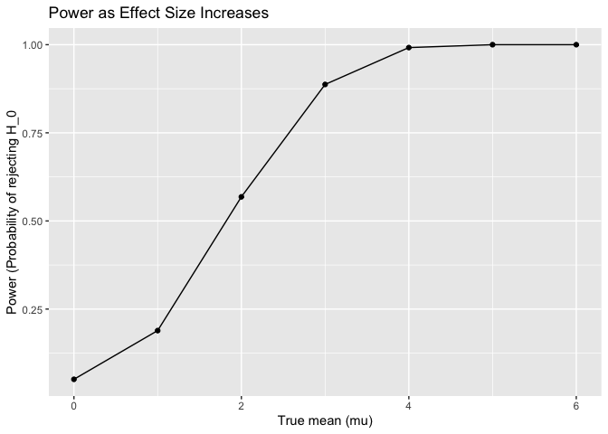
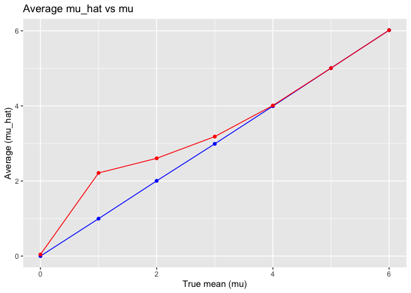

p8105_hw5_ng3005
================
Nelson Gaillard
2025-11-12

``` r
library(tidyverse)
library(rvest)
library(broom)
library(purrr)
```

## Problem 2

##### Generate `mu` and `p-value`

``` r
sim = function(n, mu, sigma) {
  x = rnorm(n, mean = mu, sd = sigma)
  ttest = t.test(x, mu = 0) 

  tibble(
    mu_hat = ttest$estimate,
    p_value = ttest$p.value
  )
}
```

##### Run 6 simulations for `mu`

``` r
set.seed(1)

results = map(0:6, function(mu) {
  map(1:5000, ~sim(n = 30, mu = mu, sigma = 5)) |> 
  bind_rows() |> 
    mutate(true_mu = mu)
  }) |> 
  bind_rows()
```

##### Association between effect size and power

Compute power for each `mu`

``` r
power_df = results |> 
  group_by(true_mu) |> 
  summarize(power = mean(p_value < 0.05))
```

Plot of `power` vs `mu`

``` r
power_df |> 
  ggplot(aes(x = true_mu, y = power)) +
  geom_line() +
  geom_point() +
  labs(
    x = "True mean (mu)",
    y = "Power (Probability of rejecting H_0",
    title = "Power as Effect Size Increases"
  )
```

<!-- -->

As shown in the plot, as the true mean (mu) increases, the probability
of rejecting the null hypothesis (H_0) increases. The data level off
around 1.00 when `mu = 5` and `mu = 6`.

Compute `mu_hat` means

``` r
summary_df = results |> 
  group_by(true_mu) |> 
  summarize(
    mean_mu_hat = mean(mu_hat),
    mean_mu_hat_sig = mean(mu_hat[p_value < 0.05])
  )
```

Create plot

``` r
summary_df |> 
  ggplot(aes(true_mu)) +
  geom_line(aes(y = mean_mu_hat), color = "blue") +
  geom_point(aes(y = mean_mu_hat), color = "blue") +
  geom_line(aes(y = mean_mu_hat_sig), color = "red") +
  geom_point(aes(y = mean_mu_hat_sig), color = "red") +
  labs(
    x = "True mean (mu)",
    y = "Average (mu_hat)",
    title  = "Average mu_hat vs mu"
  )
```

<!-- -->

Based on the plot, the sample average of `mu_hat` across tests for which
the null is reject is approximately equal to the true value of `mu` when
`mu ≥ 4`. For small effect sizes, however, the average `mu_hat` is
greater than the true `mu`. This happens due to bias, and when we
increase the statistical power (i.e. when `mu ≥ 4`), the bias is
mitigated.

## Problem 3

##### Load in the data

``` r
washington_post =
  read_csv("data/homicide-data.csv", na = c("NA", ".", "")) |> 
  janitor::clean_names()
```

    ## Rows: 52179 Columns: 12
    ## ── Column specification ────────────────────────────────────────────────────────
    ## Delimiter: ","
    ## chr (9): uid, victim_last, victim_first, victim_race, victim_age, victim_sex...
    ## dbl (3): reported_date, lat, lon
    ## 
    ## ℹ Use `spec()` to retrieve the full column specification for this data.
    ## ℹ Specify the column types or set `show_col_types = FALSE` to quiet this message.

This dataset includes the number of homicides in various cities
throughout the US. The data includes the date of the incident
(`reported_date`), the victims’ names (`victims_last`, `victims_first`),
the race of the victim (`victim_race`), the age of the victim
(`victim_age`), the sex of the victim (`victim_sex`), the location of
the incident (`city`, `state`, `lat`, `lon`), and the perpetrator’s
disposition (`disposition`).

##### Create `city_state` variable

``` r
washington_post =
  washington_post |> 
  mutate(city_state = paste(city, state, sep = ", "),
         unsolved = disposition %in% c("Closed without arrest", "Open/No arrest")
  )
```

##### Summarize total homicides and number of unsolved cases in each city

``` r
washington_post |> 
  group_by(city_state) |> 
  summarize(
    total_homicides = n(),
    unsolved_cases = sum(unsolved)
  ) |> 
  head(10) |> 
  knitr::kable()
```

| city_state      | total_homicides | unsolved_cases |
|:----------------|----------------:|---------------:|
| Albuquerque, NM |             378 |            146 |
| Atlanta, GA     |             973 |            373 |
| Baltimore, MD   |            2827 |           1825 |
| Baton Rouge, LA |             424 |            196 |
| Birmingham, AL  |             800 |            347 |
| Boston, MA      |             614 |            310 |
| Buffalo, NY     |             521 |            319 |
| Charlotte, NC   |             687 |            206 |
| Chicago, IL     |            5535 |           4073 |
| Cincinnati, OH  |             694 |            309 |

##### Calculate proportion of unsolved homicides in Baltimore, MD

``` r
washington_post |> 
  filter(city_state == "Baltimore, MD")
```

    ## # A tibble: 2,827 × 14
    ##    uid        reported_date victim_last victim_first  victim_race victim_age
    ##    <chr>              <dbl> <chr>       <chr>         <chr>       <chr>     
    ##  1 Bal-001607      20070101 NELSON      LEON          Black       17        
    ##  2 Bal-001608      20070102 GOLF        EDDIE         Black       26        
    ##  3 Bal-001609      20070105 MACKENNEY   THOMAS JOSEPH Black       21        
    ##  4 Bal-001610      20070105 CANUPP      EDWARD LEE    White       61        
    ##  5 Bal-001611      20070106 CUNNINGHAN  MICHAEL       Black       46        
    ##  6 Bal-001612      20070106 ALSTON      RAY WILLIAM   Black       27        
    ##  7 Bal-001613      20070107 HENDERSON   YULE ANTONIO  Black       21        
    ##  8 Bal-001614      20070108 MCDOWELL    MARCU         Black       16        
    ##  9 Bal-001615      20070108 GARDNER     RODNEY THOMAS Black       21        
    ## 10 Bal-001616      20070108 BURNETTE    NELSENE       Black       44        
    ## # ℹ 2,817 more rows
    ## # ℹ 8 more variables: victim_sex <chr>, city <chr>, state <chr>, lat <dbl>,
    ## #   lon <dbl>, disposition <chr>, city_state <chr>, unsolved <lgl>

``` r
x = sum(washington_post$unsolved)
n = nrow(washington_post)

prop.test(x, n) |> 
  broom::tidy() |> 
  select(estimate, conf.low, conf.high) |> 
  knitr::kable()
```

| estimate |  conf.low | conf.high |
|---------:|----------:|----------:|
| 0.507963 | 0.5036634 | 0.5122614 |

##### Calculate proportion of unsolved homicides in all cities

``` r
washington_post |> 
  group_by(city_state) |> 
  summarize(
    x = sum(unsolved, na.rm = TRUE), 
    n = n()
  ) |> 
  mutate(
    test = map2(x, n, ~prop.test(.x, .y)),
    tidy = map(test, broom::tidy)
  ) |> 
  unnest(tidy) |> 
  select(city_state, x, n, estimate, conf.low, conf.high) |> 
  head(10) |> 
  knitr::kable()
```

    ## Warning: There was 1 warning in `mutate()`.
    ## ℹ In argument: `test = map2(x, n, ~prop.test(.x, .y))`.
    ## Caused by warning in `prop.test()`:
    ## ! Chi-squared approximation may be incorrect

| city_state      |    x |    n |  estimate |  conf.low | conf.high |
|:----------------|-----:|-----:|----------:|----------:|----------:|
| Albuquerque, NM |  146 |  378 | 0.3862434 | 0.3372604 | 0.4375766 |
| Atlanta, GA     |  373 |  973 | 0.3833505 | 0.3528119 | 0.4148219 |
| Baltimore, MD   | 1825 | 2827 | 0.6455607 | 0.6275625 | 0.6631599 |
| Baton Rouge, LA |  196 |  424 | 0.4622642 | 0.4141987 | 0.5110240 |
| Birmingham, AL  |  347 |  800 | 0.4337500 | 0.3991889 | 0.4689557 |
| Boston, MA      |  310 |  614 | 0.5048860 | 0.4646219 | 0.5450881 |
| Buffalo, NY     |  319 |  521 | 0.6122841 | 0.5687990 | 0.6540879 |
| Charlotte, NC   |  206 |  687 | 0.2998544 | 0.2660820 | 0.3358999 |
| Chicago, IL     | 4073 | 5535 | 0.7358627 | 0.7239959 | 0.7473998 |
| Cincinnati, OH  |  309 |  694 | 0.4452450 | 0.4079606 | 0.4831439 |
